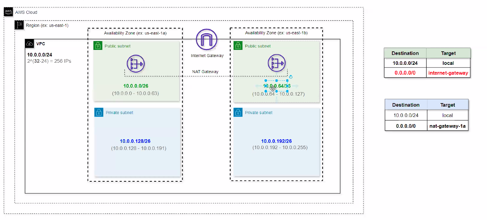

# Workshop DevOps na Nuvem

## Terraform com AWS

- Depois de rodar o terraform apply, um arquivo `terraform.tfstate` é criado. Não é bom upar isso pro github
- Então a Hashicorp (criadora do Terraform) criou o conceito de Backend Remoto
    - Na prática, a gente vai armazenar o terraform state dentro de um bucket S3, pois esse é um backend remoto compliant na Hashicorp: https://developer.hashicorp.com/terraform/language/backend/remote
- Pra utilizar um remote backend, precisamos criar um State Locking, pois dois usuários podem rodar um `terraform apply` ao mesmo tempo
    - Pra isso, a gente adiciona um lock no estado de alguma forma. Aqui, vamos utilizar o DynamoDB pra implementar esse lock
    - Exemplo, user1 e user2 disparam um `terraform apply` ao mesmo tempo. O Dynamo vai pegar o primeiro evento e vai bloquear o recurso para que o user2 nao possa usar


- Habilitar versioning no bucket s3 pelo terraform: https://registry.terraform.io/providers/hashicorp/aws/latest/docs/resources/s3_bucket_versioning

- O locking mode pelo dynamo é deprecado pela Hashicorp. Agora dá pra usar um lock_file direto criado dentro do bucket s3. Mas 90% dos códigos por aí ainda usam dynamoDB
- Da pra implementar state locking em várias plataformas, um postgres, kubernets, etc

- Terraform Workspaces permite criar um ambiente de dev/demo/prod

### Nginx ingress nao vai mais ser continuado pelo K8s a partir de maio de 2026. O SGW usa, vão mudar?`

## Redes em Cloud - AWS

- VPC - Virtual Private Cloud
    - Onde isolamos todos os recursos e componentes da Cloud se intercomunicarem e não se exporem para o public address
- CIDR - Classless Inter Domain Routing
    - 10.0.0.0/24 - Qual o range dessa rede? 2^(32-24) -> 32 bits é o tamanho da rede
        - 256 IPs
        


Na imagem acima, tem 4 subnets /26 de 64 IPs, totalizando 256 IPs da VPC.

- 1a e 1b no sufixo da region é a AZ - locais físicos onde está o datacenter da AWS
- As aplicações sempre ficam em subnets privadas, o trafégo ocorre somente dentro da infra da AWS
- Para expor as aplicações para subnets públicas, a gente cria um Load Balancer nas públicas
    - Application Load Balancer com schema Internet Facing na AWS
- Precisa necessariamente ter uma subnet pública para cada privada
- Existe um Internet Gateway entre a VPC e o mundo la fora, que permite a comunicação. 

**As public subntes apontam sempre para uma tabela de roteamento cuja rota padrão (0.0.0.0/0) é um Internet Gateway, e as privadas não. Isso é o que fundamentalmente difere subnets privadas de públicas**

- nat-gateway garante tráfego outbound (saindo da VPC). Isso permite que a subnet privada envie seus pacotes para a Internet.
    - NAT tem IP público, ele vai mandar pro Internet Gateway a request, que vai verificar o DNS da google.com, retornar para o NAT, que vai retorar para a máquina dentro da subnet privada.
- NAT apenas tem acesso ao tráfego solicitado (request), não tem acesso a receber tráfegos (inbound).
- Internet Gateway tem IPs públicos, então permite inbound e outbound.
- Existe apenas um Internet Gateway por VPC, mas podem existir um NAT para cada subnet privada
- O NAT Gateway tem q ficar atrelado à uma public subnet, e ambas private subnets comunicam apenas com um NAT gateway
    - **Um NAT gateway com cross region traffic é mais barato que um NAT gateway em cada public subnet**
- AWS reserva 6 IPs por subnet obrigatoriamente para management

### Hands-on
Steps:
1. Subnets publicas (Internet Gateway -> Subnet Publica)
2. Subnets privadas
3. Criação do Cluster

- Criação de EC2 Publico- 
    - Chamado de bastion host -> A bastion host is a special-purpose server that acts as a secure gateway between a public and a private network, protecting internal systems from direct exposure to the internet
    - Da pra acessar por ssh essa instância

- Criação de EC2 Privado
    - No canal do youtube dele tem 3 formas de acessar a instância privada
    - Aqui para acessar vamos conectar na bastion-host (EC2 publica), que através dela vai ser possível conectar no EC2 privado
    - Precisa copiar a private key pra dentro da EC2 publica, pra que de dentro dela, a gente consiga conectar na instância privada:
        - Dá pra fazer isso por SSM (Systems Manager Agent) em vez de copiar a chave assim, que não é muito legal
```
scp -i "youtube-private-key.pem" youtube-private-key.pem ec2-user@98.86.161.104:~/
```

## Kubernetes

Cluster ECS - Da AWS, ele ja te dá ingress, pods, nodePort e tudo pronto. 
Cluster EKS - Managed pelo K8s - Aqui a gente tem q criar todos os recursos por yaml

O Node group provisiona instâncias EC2, que são literalmente as máquinas que vão rodar nossas aplicações

Depois de provisionar a stack 02, dá pra rodar isso aqui pra conseguir pegar o kubeconfig e acessar os nodos do cluster:

```
aws eks update-kubeconfig --region us-east-1 --name workshop-2-eks-cluster --profile arthurdb-assumed

k get nodes
```

### Deploy

Na pasta my-app, dá pra rodar o kustomize e depois somente aplicar o arquivo kustomization.

```
kustomize build .

k apply -k .

kustomize edit set image <image_name>:v1.0=<image_name>:v2.0
```
